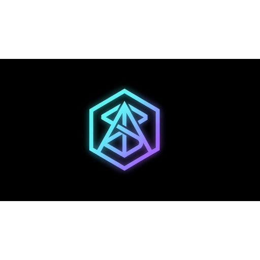

<div align="center">



# SynArc DAO

**SynArc is governance infrastructure for the agentic economy enabling DAOs, AI agents, and autonomous systems to coordinate, vote, and manage USDC-native treasuries on Arc. The first multi-DAO governance layer built natively on Arc with Circle’s full stablecoin stack.**

[](https://nextjs.org)
[](https://typescriptlang.org)
[](https://tailwindcss.com)
[](https://arc.network)
[](https://privy.io)
[](https://openzeppelin.com)

[**Launch App →**](https://www.synarcdao.xyz/) · [**Documentation**](https://docs.arc.network) · [**Arc Ecosystem**](https://arc.network)

</div>

---

## 1. Introduction

SynArc is governance infrastructure for the agentic economy enabling DAOs, AI agents, and autonomous systems to coordinate, vote, and manage USDC-native treasuries on Arc. The first multi-DAO governance layer built natively on Arc with Circle’s full stablecoin stack.

Designed for institutional-grade decentralized organizations, SynArc provides the full governance lifecycle stack: from on-chain proposal creation and off-chain gasless voting to treasury execution and confidential coordination  all denominated natively in USDC.

SynArc is built for the **agentic economy**: a world where DAOs, autonomous agents, and programmable organizations coordinate at scale without compromising operational security or member privacy.

Key features include:
*   **Confidential Governance**: Secure voting mechanisms that protect participant intent and delegate integrity.
*   **USDC-Native Treasury Coordination**: Real-time management and deployment of stablecoin reserves.
*   **Proposal Execution**: Automated and programmable governance execution through timelock controller modules.
*   **Programmable Organizations**: Modular and composable smart contract building blocks for decentralized organizations.
*   **Governance Infrastructure**: A complete stack encompassing smart contracts, indexers, state management, and an interactive front-end.
*   **Agentic Economy Alignment**: Native integration pathways for AI agents, multi-sig controls, and autonomous protocols to act as governance participants.

```
Proposal Creation ──> Off-Chain Signing ──> On-Chain Queue ──> Treasury Settlement
```

---

## 2. Vision

The next generation of decentralized organizations will require more than simple token-weighted voting. They demand:

*   **Confidential governance** — Vote without exposing your position to frontend frontrunning until consensus is reached, preserving market independence.
*   **USDC-native treasury coordination** — Eliminate currency risk for operational spending by coordinating entirely in stable, programmable capital.
*   **Programmable organizations** — Automate operational procedures and system parameters using Timelock and modular architecture.
*   **Agentic economy alignment** — Provide secure APIs, cryptographic delegation, and gasless voting pathways optimized for AI agents and autonomous protocols.
*   **Arc-native design** — Leverage Arc's high-performance, low-latency execution environment to power responsive, high-fidelity coordination tools.

SynArc is the infrastructure layer that makes this future possible today.

---

## 3. Features

*   **Proposals**: Create, discuss, and vote on governance proposals
*   **Treasury**: Real-time management and analytics of DAO assets in USDC
*   **Wallet Connect**: Hybrid wallet system supporting both Privy embedded wallets and Circle Programmable Wallets, giving users the choice between standard (social/Google/external) and fully gasless USDC-native governance participation.
*   **Arc Testnet Integration**: Native support for Arc Testnet with zero-latency execution
*   **USDC Balance Display**: Real-time balance tracking and treasury visualization
*   **Dashboard Analytics**: Governance participation metrics and voting trends
*   **Responsive Design**: Mobile-first interface with glassmorphism effects
*   **⚡ Crowdfund Hub** — permissionless USDC crowdfunding for humans and AI agents
*   **🤖 Autonomous Agent Fund** — AI-created campaigns with on-chain validation
*   **👤 Human Campaigns** — builder and community funding campaigns
*   **🏦 Milestone Escrow** — funds locked until community votes approve each milestone
*   **💸 1:1 USDC releases** — direct to beneficiary on approval

---

## 4. Arc Ecosystem Alignment

SynArc is built natively for **Arc** — a high-performance, EVM-equivalent blockchain engineered to power the agentic economy.

| Arc Specification | Value |
| :--- | :--- |
| **Network Name** | Arc Testnet |
| **Chain ID** | `5042002` |
| **RPC URL** | `https://rpc.testnet.arc.network` |
| **Currency** | USDC |
| **Block Explorer** | [testnet.arcscan.app](https://testnet.arcscan.app) |
| **Fallback RPC 1** | `https://arc-testnet.drpc.org` |
| **Fallback RPC 2** | `https://5042002.rpc.thirdweb.com` |

Arc's dedicated focus on institutional-grade settlement, native USDC capital, and autonomous agent participation perfectly aligns with SynArc's governance framework.

### Canteen ARC CLI & Resilient RPC Fallbacks

SynArc is integrated with the **Canteen Builder Program**, providing personalized high-performance RPC connections and gasless transaction routing for all critical treasury and governance operations.

#### CLI Installation & Commands

To manage and retrieve your personalized Canteen RPC endpoints, install the Canteen ARC CLI tool:

```bash
# Install uv tool suite (if not present)
curl -LsSf https://astral.sh/uv/install.sh | sh

# Install the Canteen ARC CLI
uv tool install git+https://github.com/the-canteen-dev/ARC-cli
```

Once installed, use the following commands:
*   `arc-canteen login` - Log into your Canteen developer account.
*   `arc-canteen rpc-url` - Fetch your personalized, high-performance Arc RPC endpoint.
*   `arc-canteen update product` - Sync your latest product status with the Canteen registry.

#### Centralized 4-Endpoint RPC Resiliency Chain

To ensure uninterrupted uptime for our users and AI agents, the SynArc frontend implements a centralized sequential fallback resolver traversing four RPC nodes in priority order:
1.  **Personalized Canteen RPC** (`process.env.NEXT_PUBLIC_ARC_RPC_URL`)
2.  **Arc Testnet Public RPC** (`https://rpc.testnet.arc.network`)
3.  **dRPC Arc Testnet Node** (`https://arc-testnet.drpc.org`)
4.  **Thirdweb Arc Testnet Node** (`https://5042002.rpc.thirdweb.com`)

If the primary endpoint experiences rate limits or downtime, the system transparently loops through the fallback nodes to maintain client connectivity.

---

## 5. Governance Infrastructure

SynArc utilizes a modular, battle-tested governance stack that brings enterprise-level safety to on-chain organizations.

```
┌────────────────────────────────────────────────────────┐
│                     SynArc Protocol                    │
│                                                        │
│  ┌──────────────┐  ┌──────────────┐  ┌─────────────┐  │
│  │   Governor   │  │  Timelock    │  │  Treasury   │  │
│  │  (OZ Votes)  │──│ Controller  │──│  (USDC)     │  │
│  └──────────────┘  └──────────────┘  └─────────────┘  │
│           │                                  │         │
│  ┌──────────────┐                  ┌─────────────┐    │
│  │  Off-Chain   │                  │   Delegate   │    │
│  │   Voting     │                  │   Registry   │    │
│  └──────────────┘                  └─────────────┘    │
└────────────────────────────────────────────────────────┘
```

### Proposal Lifecycle
1.  **Creation**: Members with voting power above the `proposalThreshold` propose executable transactions on-chain.
2.  **Pending**: A configurable delay allows members to adjust delegations before voting snapshot is finalized.
3.  **Active**: Token holders cast votes (For, Against, or Abstain) cryptographically signed via their embedded wallets.
4.  **Passed**: Proposals meeting quorum and majority requirements are queued into the `TimelockController`.
5.  **Execution**: After the timelock delay expires, the proposed transactions are executed, dispersing funds or modifying configurations.

---

## 6. Treasury Coordination

SynArc coordinates and reports on DAO treasury assets entirely in **USDC**, ensuring predictable, low-volatility financial runway for organizations.

*   **Liquid Reserves**: Operating capital held in secure, highly liquid multisig vaults (Target: 82%).
*   **Yield Generation**: Capital placed in conservative yield-bearing platforms like Morpho to counter inflation (Target: 15%).
*   **Ecosystem Liquidity**: Deployed in automated market makers like ArcDEX to maintain token and LP stability (Target: 3%).

All treasury interactions are authorized strictly via successful governance outcomes, precluding single-point-of-failure vulnerabilities.

---

## 7. Tech Stack

### Frontend
*   **Framework**: [Next.js 15 (App Router)](https://nextjs.org)
*   **Language**: [TypeScript 5](https://typescriptlang.org)
*   **Styling**: [TailwindCSS 4](https://tailwindcss.com)
*   **Animations**: [Framer Motion 11](https://framer.com/motion)
*   **Design Tokens**: [shadcn/ui](https://ui.shadcn.com)
*   **State Management**: [Zustand](https://zustand-demo.pmnd.rs)

### Web3 Integration
*   **Authentication & Embedded Wallets**: [Privy](https://privy.io)
*   **Ethereum Provider Interface**: [Wagmi 2](https://wagmi.sh)
*   **Low-Level Client Library**: [Viem 2](https://viem.sh)

### Smart Contracts
*   **Governance Engine**: `SynArcGovernor` (inherits from [OpenZeppelin Governor](https://openzeppelin.com))
*   **Execution Delay**: `TimelockController` (OpenZeppelin)
*   **Voting Mechanism**: `SynArcToken` (ERC20Votes)
*   **Asset Management**: `SynArcTreasury` (EVM USDC multi-signature integration)

### Network
*   **Execution Layer**: Arc Testnet


---

## 7a. Complete Tech Stack

**Frontend & Styling**:
- Next.js 15 - React framework with App Router
- TailwindCSS 4 - Utility-first CSS framework
- Framer Motion - Animation library

**Web3 Integration**:
- Privy - Authentication and embedded wallets
- ethers.js - Ethereum library (via Viem compatibility)
- Wagmi / Viem - Low-level web3 client

**Deployment**:
- Vercel - Hosting and deployment platform

---
## 8. Architecture

```
synarc-dao/
├── app/
│   ├── (dashboard)/          # Authenticated and protected application views
│   │   ├── dashboard/        # Main governance metrics & action cards
│   │   ├── proposals/        # Interactive proposal feed and creation wizard
│   │   └── treasury/         # Comprehensive treasury ledger and visual reports
│   ├── (marketing)/          # Public-facing brand presentation and landing views
│   │   └── page.tsx          # Homepage with integrated roadmap timeline
│   └── api/                  # API endpoints and background event webhooks
├── components/
│   ├── ui/                   # Reusable atomic design tokens (GlassCard, SynArcLogo, etc.)
│   ├── layout/               # Global page layouts, navigation components, and footers
│   ├── dashboard/            # Specialized widgets and telemetry cards
│   ├── proposals/            # Proposal creation, voting, and timeline sub-components
│   └── sidebar/              # Responsive sidebar navigation controls
├── hooks/
│   ├── useGovernanceStore.ts # Global Zustand state provider managing simulated states
│   ├── useUSDCBalance.ts     # Live balance fetcher utilizing ERC-20 contract interfaces
│   └── useSwitchArcNetwork.ts# Automated RPC configuration and chain-switching utility
├── lib/                      # Base configurations, utilities, and helper functions
├── providers/                # Top-level React wrappers (Web3, Privy, Theme)
└── styles/                   # Core Tailwind configurations and global styles
```

---

## 9. Roadmap

### Current (Phase 1 & Phase 2) — Active Testing & UI
*   **Phase 1 — Governance Frontend**:
    *   [x] Establish clean, modern landing pages and Arc-native aesthetics.
    *   [x] Build real-time analytics dashboard with deep data visualization.
    *   [x] Deploy responsive, mobile-optimized glassmorphic UI layout.
    *   [x] Build proposal submission and detail view pages.
*   **Phase 2 — Authentication Infrastructure**:
    *   [x] Integrate Privy authentication with custom app identifiers.
    *   [x] Enable secure embedded wallets with background keys.
    *   [x] Enable zero-gas cryptographic signature verification.
    *   [x] Integrate live balance polling from Arc Testnet nodes.
    *   [x] Crowdfund Hub prototype (milestone escrow, AI governance, human + agent campaigns)
    *   [ ] SynArcFundingVault contract deployment
    *   [ ] Live USDC milestone releases on-chain

### Upcoming (Phase 3 & Phase 4) — On-Chain Integration
*   **Phase 3 — Governance Contracts**:
    *   [ ] Deploy custom OpenZeppelin Governor and ERC20Votes contracts on Arc Testnet.
    *   [ ] Set up TimelockController logic with custom execution buffers.
    *   [ ] Integrate actual EVM smart contract reads/writes into the UI.
    *   [ ] Connect proposal submission directly to on-chain transactions.
*   **Phase 4 — Arc Ecosystem Integration**:
    *   [ ] Coordinate real USDC-denominated treasury disbursements.
    *   [ ] Connect autonomous AI agents to vote natively on active proposals.
    *   [ ] Deploy on-chain delegate registries for frictionless delegation.

### Future (Phase 5) — Advanced Architecture
*   **Phase 5 — Confidential Governance**:
    *   [ ] Implement encrypted voting via Zero-Knowledge (ZK) proofs.
    *   [ ] Enable private coordinator sets to shield voting positions during voting periods.
    *   [ ] Release SynArc TypeScript SDK for seamless integration into other Arc ecosystem apps.
### Planned Features
*   **Members**: Member management and delegation interfaces
*   **Analytics**: Advanced governance analytics and reporting
*   **Settings**: DAO configuration and parameter management
*   **Mainnet Integration**: Production deployment on Arc Mainnet for real-asset management


## 10. Deployment

## Live Deployment
https://www.synarcdao.xyz/

### Deploying to Vercel
1.  Install the Vercel CLI globally:
    ```bash
    npm install -g vercel
    ```
2.  Initiate deployment from the `synarc-dao` subfolder:
    ```bash
    vercel --prod
    ```
3.  In the Vercel project settings page, add the corresponding environment variables:
    *   `NEXT_PUBLIC_PRIVY_APP_ID`
    *   `NEXT_PUBLIC_RPC_URL`

### Privy Production Settings
1.  Log into your dashboard at [privy.io](https://privy.io).
2.  Add your production URL to the **Allowed Origins** whitelist.
3.  Ensure the "Embedded Wallets" toggle is set to `Enabled` under login methods.

---

## 11. Folder Structure

SynArc organizes its code base into high-cohesion, low-coupling directories to maximize development efficiency:

```
synarc-dao/
├── app/                      # Next.js 15 app router pages & api paths
├── components/               # UI components, layout models, sub-systems
├── contracts/                # Smart contract repositories (Hardhat/Foundry)
├── data/                     # Configuration JSONs and mock records
├── hooks/                    # Reusable React hooks (web3 connections, stores)
├── lib/                      # Client setup files, cryptographic utils
├── providers/                # React Global context wrappers
├── public/                   # Static images, icons, and assets
├── styles/                   # Global style sheets & Tailwind targets
├── types/                    # System-wide static type safety interfaces
├── utils/                    # Clean mapping and math helper functions
├── package.json              # Project packages and build scripts
└── tsconfig.json             # Compiler rules for TypeScript
```

---

## 12. Security Philosophy

SynArc is developed with a strict security-first mindset, preparing for institutional integration:

*   **Trustless Settlement**: The `TimelockController` acts as a non-bypassable barrier, ensuring all token holders have sufficient warning to withdraw funds if malicious updates pass.
*   **Decentralized Control**: No admin keys, multi-sigs, or backdoors. The governance smart contract is the sole owner of the treasury and other core protocol components.
*   **Non-Custodial Integrity**: User private keys are never transmitted, stored, or managed by the SynArc server layer. All cryptographic keys are secured directly via hardware and client-side systems using Privy.
*   **Mathematical Transparency**: All votes are verified cryptographically via ECDSA signatures on the client side, ensuring full provability of election inputs.

> ⚠️ **Warning**: SynArc's smart contracts are currently undergoing internal pre-audit reviews. Ensure proper testing on Arc Testnet before committing high-value operational reserves.

---

## 13. Future Plans

| Initiative | Timeline | Objectives |
| :--- | :--- | :--- |
| **Mainnet Transition** | Q3 2026 | Audited production deployment of Governor and Timelock Controller models on Arc Mainnet. |
| **Privacy Expansion** | Q4 2026 | Private coordinator election setups, ZK-Snark voting protocols, and secret ballot options. |
| **Autonomous Execution** | Q1 2027 | AI agent delegation layers with automated intent checking and programmable execution limits. |
| **Ecosystem Bridges** | Q2 2027 | Cross-chain governance links allowing remote treasury operations via safe bridges. |

---

## 14. License

This repository is licensed under the **MIT License**. Check [LICENSE](./LICENSE) for additional details.

---

## 15. New Features

### AI Agent Governance
SynArc supports AI agents participating in governance:
- AI proposal analysis on every proposal
- Agent voting with on-chain transparency  
- Public governance API for external agents
- Agent registry at /agents

### DAO Registry
Multi-DAO support — other communities can deploy on SynArc:
- Apply at synarcdao.xyz/daos
- Contact: devsynarc@gmail.com
- Telegram: @Kellycryptos

### Circle Integration
USDC-native treasury management, payments, and bridging:
- Powered by Circle Bridge Kit and CCTP
- USDC/EURC dual stablecoin treasury vaults
- Instant cross-chain bridging with 20-second finality
- Seamless payouts via the Circle Payments Network (CPN)

---

<div align="center">

**Built for the Arc agentic economy.**

[Website](https://www.synarcdao.xyz/) · [Twitter](https://x.com/synarc_) · [GitHub](https://github.com/kellycryptos/SynArc) · [Arc Network](https://arc.network)

<sub>© 2026 SynArc. All rights reserved.</sub>

</div>
