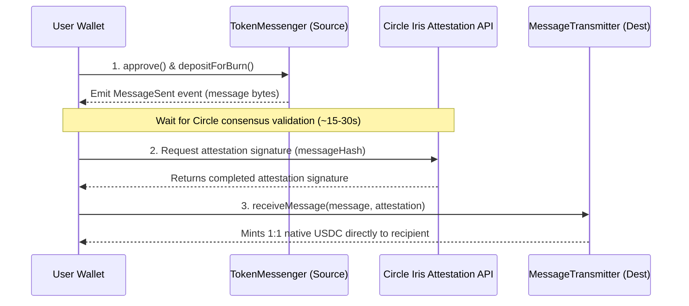

# Secure Transfer Bridge

Cross-network fund mobility is essential for active workspaces. SynArc integrates secure, direct bridge protocols to support bidirectional, 1:1 transfers of stable digital dollars (USDC) between Arc Testnet and other major networks, without the risks of intermediary wrapping contracts.

***

## Bidirectional Transfer Flows

SynArc supports bridging in both directions:
1. **Deposit (IN)**: Bridge USDC from Ethereum Sepolia, Base Sepolia, Avalanche Fuji, or Solana Devnet onto Arc Testnet to fund a project workspace, deposit into the Treasury, or back active campaigns.
2. **Withdraw (OUT)**: Bridge USDC from Arc Testnet back to Ethereum Sepolia, Base Sepolia, Avalanche Fuji, or Solana Devnet to distribute assets to external participant vaults.

### How Direct Transfers Work Under the Hood

Cross-Chain Transfer Protocol (CCTP) is a native utility by Circle that enables secure burn-and-mint transfers of USDC across blockchains. No liquidity pools or third-party wrappers are used.

#### The 4-Step Bridge Pipeline
1. **01 - Burn USDC on Source**: Initiate burn on source chain (e.g., Arc Testnet or Ethereum Sepolia).
2. **02 - Circle Consensus Attestation**: Poll Circle Sandbox Iris API for consensus validation.
3. **03 - Attestation Signed & Received**: Cryptographic proof generated and returned by Circle.
4. **04 - Mint USDC on Destination**: Submit message and attestation to complete mint on destination chain.

> 💡 **Try It Yourself:** Trigger a CCTP Transfer on the **Bridge** tab or run a rebalance on the **Agent** dashboard to see this pipeline execute live in real-time.

---

## Step-by-Step Guides

### 1. Depositing USDC (IN) to Arc Testnet
To bridge USDC from an external chain into Arc Testnet:
1. Navigate to the **Bridge** tab on the dashboard sidebar.
2. Ensure the toggle is set to **Deposit (IN)**.
3. Select your origin chain (e.g., *Ethereum Sepolia*, *Base Sepolia*, *Avalanche Fuji*).
4. Enter the amount of USDC you wish to deposit.
5. Click **Initiate Cross-Chain Bridge**:
   - **Approve**: Your wallet will prompt you to approve the origin TokenMessenger (`0x8fe6b...`) to spend your USDC.
   - **Burn**: A second transaction will submit the burn instruction.
   - **Attestation**: The SynArc interface polls Circle's Iris sandbox API for consensus proofs.
   - **Mint**: The app switches your wallet to Arc Testnet (`chainId: 5042002`) and submits the mint transaction to the Arc MessageTransmitter.
6. Your native USDC is now available on Arc Testnet.

### 2. Withdrawing USDC (OUT) from Arc Testnet
To withdraw your USDC reserves back to an external chain:
1. Navigate to the **Bridge** tab.
2. Switch the toggle to **Withdraw (OUT)**.
3. Select your target destination chain.
4. Enter the amount of USDC you wish to withdraw.
5. Click **Initiate Cross-Chain Bridge**:
   - **Approve**: Approve the Arc TokenMessenger (`0x8FE6B...`) to spend your Arc USDC.
   - **Burn**: Submit the burn instruction on Arc Testnet.
   - **Attestation**: The app polls the Circle Iris API.
   - **Mint**: The app switches your wallet to the destination chain (e.g., Base Sepolia) and claims the minted native USDC.

---

## Official CCTP Deployed Contracts

SynArc coordinates with the following verified Circle contract endpoints:

| Chain | Domain ID | TokenMessenger Address | MessageTransmitter Address | USDC Contract Address |
| :--- | :---: | :--- | :--- | :--- |
| **Arc Testnet** | `7` | `0x8FE6B999Dc680CcFDD5Bf7EB0974218be2542DAA` | `0xE737e5cEBEEBa77EFE34D4aa090756590b1CE275` | `0x3600000000000000000000000000000000000000` |
| **Ethereum Sepolia** | `0` | `0x8fe6b999dc680ccfdd5bf7eb0974218be2542daa` | `0xe737e5cebeeba77efe34d4aa090756590b1ce275` | `0x1c7d4b196cb0c7b01d743fbc6116a902379c7238` |
| **Base Sepolia** | `6` | `0x8fe6b999dc680ccfdd5bf7eb0974218be2542daa` | `0xe737e5cebeeba77efe34d4aa090756590b1ce275` | `0x036CbD53842c5426634e7929541eC2318f3dCF7e` |
| **Avalanche Fuji** | `1` | `0x8fe6b999dc680ccfdd5bf7eb0974218be2542daa` | `0xe737e5cebeeba77efe34d4aa090756590b1ce275` | `0x5425890298aed601595a70AB815c96711a31Bc65` |
